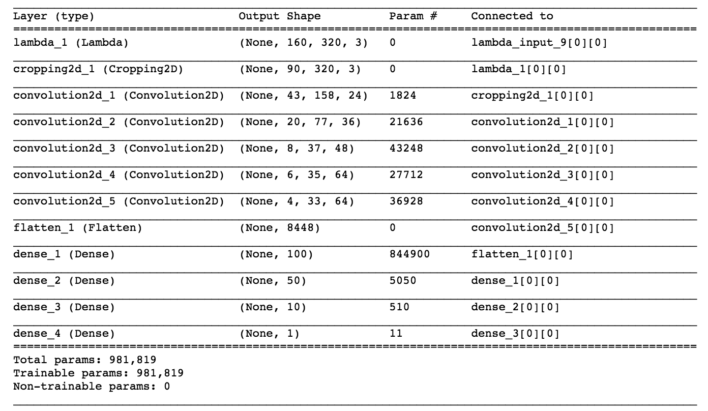
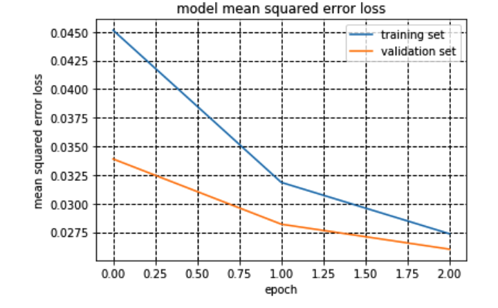
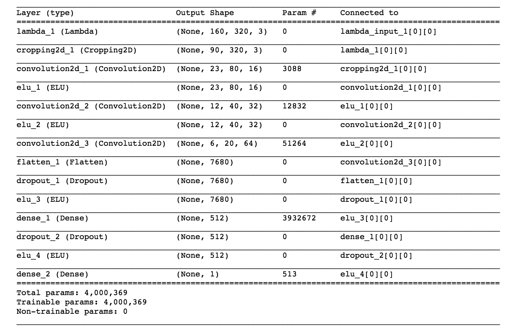
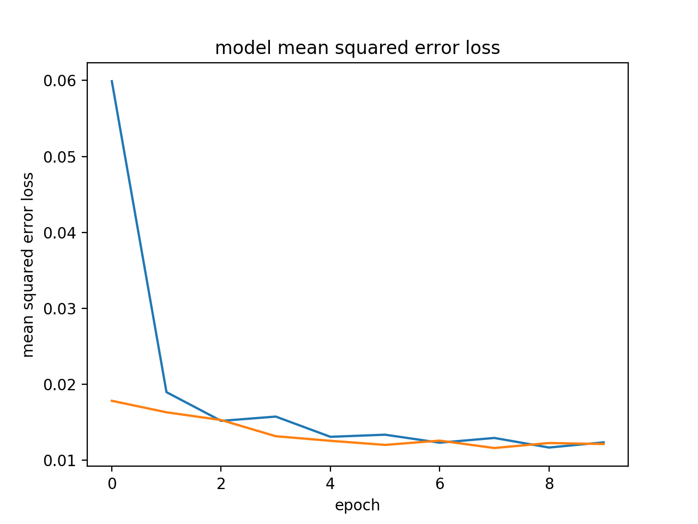
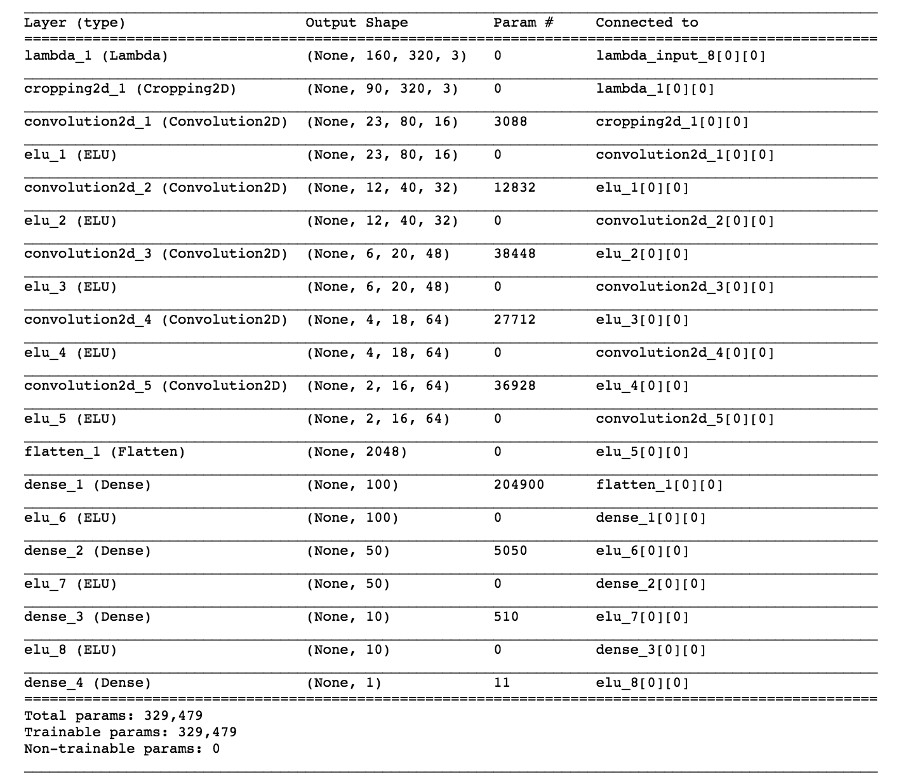
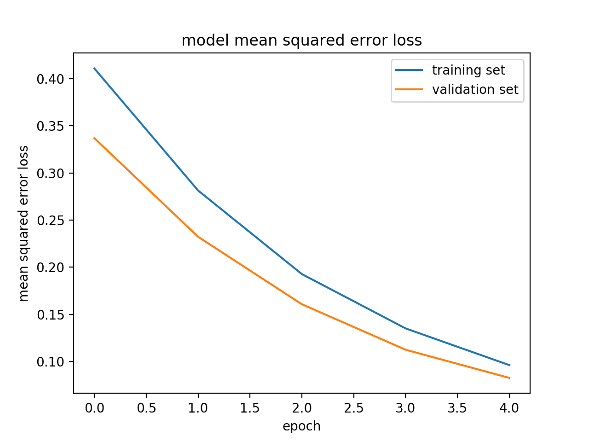
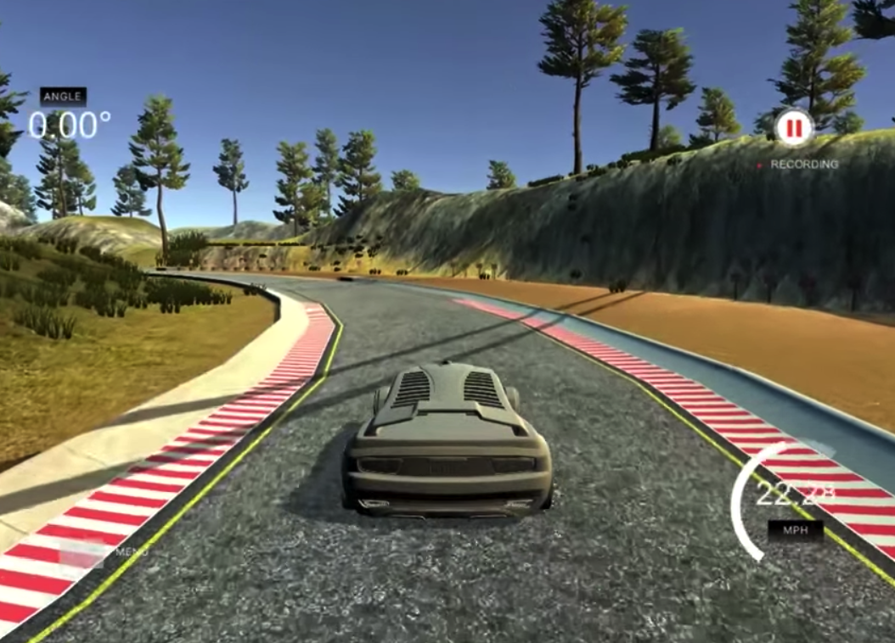

# **Udacity Self-Driving Car Behavioral Cloning Project** 

### Jay Urbain

Build a convolutional nerual network model to autonomously drive a car around a simulated test track.

Here is a link to the project [project code](https://github.com/jayurbain/self-driving-car/blob/master/CarND-Behavioral-Cloning-P3)

---

**Behavioral Cloning Project**

The goals / steps of this project are the following:
* Use the simulator to collect data of good driving behavior
* Build, a convolution neural network in Keras that predicts steering angles from images
* Train and validate the model with a training and validation set
* Test that the model successfully drives around track one without leaving the road
* Summarize the results with a written report

## Installation

You need [Miniconda](https://conda.io/miniconda.html) installed(please visit [this link](https://conda.io/docs/install/quick.html) for quick installation instructions.)

# Installation
To create an environment for this project use the following command:

```
conda env create -f environment.yml
```

After the environment is created, it needs to be activated with the command:

```
source activate carnd-term1
```

## Summary

### Convolutional Models

Several convolutional models were evaluated:
- nVida Model, 3 epochs, no regularization 
  - model_nVidia_e3.h5
- nVida Model, 5 epochs, L2 regularization 
  - nVidiaModelRegularization_e5.h5
- comma.ai model, 3 and 10 epochs, 0.5 dropout regularization 
  - model_commaAiModel_e3.h5
  - model_commaAiModel_e10.h5
- comma.ai with additional convolutional layers, 5 and 20 epochs, L2 regularizaton
  - model_commaAiModelPrime_e5.h5
  - model_commaAiModelPrime_e20.h5

Several methods were tried. In general, relatively simpler models like nVidia with and without L2 reguarization and training only over a few epochs (3 to 5) performed as well as more complex models like comma.ai enhanced with 3 additional convolution layers and L2 regularization.  All *but* the standard comma.ai model (model_commaAiModel_e3 and model_commaAiModel_e10) successfully naviagated the track. 

Simpler is often better!

model.h5 and video.mp4 is were generated with model_commaAiModelPrime_e5.h5 

All models were created using Keras.

These are the most relevant project files:
* model.py containing the script to create and train the model
* drive.py for driving the car in autonomous mode
* model.h5 containing a trained convolution neural network 
* writeup_report.md or writeup_report.pdf summarizing the results

## Models ##

### nVidia Model



### nVidia model_nVidia_e3 MSE


### comma.ai Model


### comma.ai Model MSE


### comma.ai Prime Model - enhanced with 3 additional convolution layers, L2 regularization


### comma.ai Prime Model MSE


### Training data

One data set was provided by Udacity.

Two additional datasets were collected using the simulator. One driving clockwise around the test track, and one driving counter-clockwise around the test track. The rationale is that if you only drive around the first track in a clock-wise direction, the data will be biased towards left turns. 



The additional data collected did not improve performance over training with the standard data set.

### Data preprocessing

Normalizing the data:  
``` python
pixel_normalized = pixel / 255 
```

Mean centering the data:  
``` python
pixel_mean_centered = pixel_normalized - 0.5
```

Implemented with Keras Lambda layer:  
```python
model.add(Lambda(lambda x: (x / 255.0) - 0.5, input_shape=(160,320,3)))
```

### Flipping Images And Steering Measurements  
Due to the clockwise direction of the test track, the model pulls to the left. A way to generalize the data is to create a second copy of the images where the images flipped and steering angles reveresed.

``` python
import numpy as np  
image_flipped = np.fliplr(image)  
measurement_flipped = -measurement  
```

### Use center, left, and right cameras  
To use the left image a postive steering correction factor is used.  To use the right image a negative steering correction factor is used.  We tried several different correction factors. This strategy did not help our results and is not incuded in our final model.

``` python
### Create adjusted steering measurements for the side camera images  
correction = 0.2 # this is a parameter to tune  
steering_left = steering_center + correction   
steering_right = steering_center - correction  
```

### Crop images
Images were cropped from top and bottom to remove areas not relevant to steering.  
```python
model.add(Cropping2D(cropping=((50,20), (0,0)))) 
```

### Histogram of steering measurements to normalize the training data

The test track includes long sections with very slight or no curvature, to balance the dataset, a historgram was generated for steering wheel angles. Images with close to 0 steering angle distribution were sub-samled to balance the training data.

This approach was abandoned since it seemed to hurt performance. The car wobbled from side to side more. For reference, below is a plot of the histogram.

### Outputting Training and Validation Loss Metrics
In Keras, the model.fit() and model.fit_generator() methods have a verbose parameter that tells Keras to output loss metrics as the model trains. The verbose parameter can optionally be set to verbose = 1 or verbose = 2.

Python Generators:
Generators can be a great way to work with large amounts of data. Instead of storing the preprocessed data in memory all at once, using a generator you can pull pieces of the data and process them on the fly only when you need them, which is much more memory-efficient.

Adam optimizer was use with MSE loss.


