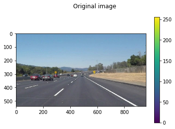

# **Finding Lane Lines on the Road** 

## # Self-Driving Car Engineer Nanodegree

## Project: **Finding Lane Lines on the Road** 

Jay Urbain

---

**Finding Lane Lines on the Road**

The goals / steps of this project are the following:
* Make a pipeline that finds lane lines on the road
* Reflect on your work in a written report

In this project, we built an image processing pipeline using methods for finding lane lines of yellow or white color, on a background of black asphalt or light concert. 

The pipeline was developed using road test images, and evaluated on a series of 3 road videos.

Here's the github repository for this work:  https://github.com/jayurbain/self-driving-car

[//]: # (Image References)

[image1]: ./examples/grayscale.jpg "Grayscale"

---

### Reflection

### 1. Describe your pipeline. As part of the description, explain how you modified the draw_lines() function.

*Pipeline:*
1 - Color selection for lane lines: yellow, white  
2 - Region of interest selection  
3 - Grayscaling   
4 - Gaussian smoothing  
5 - Canny Edge Detection  
6 - Hough Tranform line detection: rho>1, higher threshold   
7  -Draw lane lines by averaging line segments  

The pipeline is programmable. By setting "display_intermediates = True," intermediate images are displayed. Each image is processed with the following function:  

def procimage_turbo(
&nbsp;&nbsp;image, 
&nbsp;&nbsp;low_color_threshold,   # [B,G,R]  
&nbsp;&nbsp;high_color_threshold,  # [B,G,R]  
&nbsp;&nbsp;gaussian_smoothing_kernel_size, # odd number: 3,5,7  
&nbsp;&nbsp;low_canny_threshold,   # min candidate edges to consider as edge  
&nbsp;&nbsp;high_canny_threshold,  # for sure edge  
&nbsp;&nbsp;hough_rho,             # distance resolution in pixels of the Hough grid  
&nbsp;&nbsp;hough_threshold,       # min. number of votes (intersections) 
&nbsp;&nbsp;hough_min_line_length, # minimum number of pixels making up a line  
&nbsp;&nbsp;hough_max_line_gap     # maximum gap in pixels between connectable line segments  
	):

The pipeline has 2 stages for processing each image/video frame. It is executed by calling:  
def process_image_exec(image):  

In the first stage, process_image_exec() calls procimage_turbo() to optimize white/yellow lane line detection on asphalt (dark surface). If that fails, it calls procimage_turbo() with relaxed thresholds. Using the second stage allows us to successfully complete the optional challenge video!!!

Below are intermediary images of the pipeline. 

### 2. Identify potential shortcomings with your current pipeline

The most significant shortcoming of the pipeline was the need to hand tune the 2-stage soltion. A more adaptable approach would be preferable.

### 3. Suggest possible improvements to your pipeline

First, the pipeline worked surprising well. I believe the pipeline could be improved by using a continually adaptable pipeline, i.e., rather than just 2 stages, iteratively tune hyperparmeters to "search for" lane lines until you are successfull.

A second improvement could be more sophisticated image processing.
