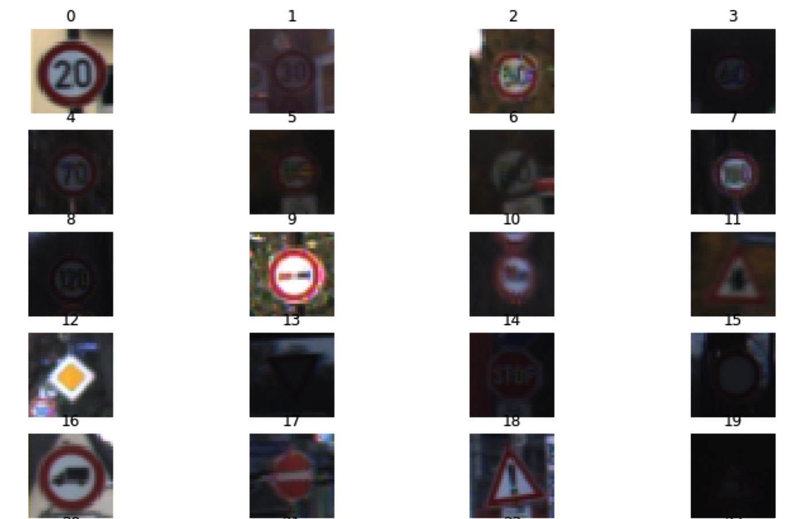
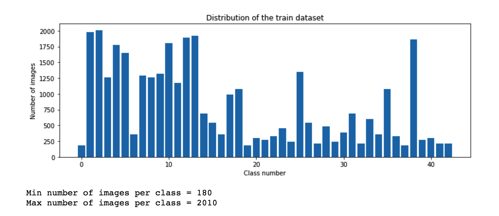
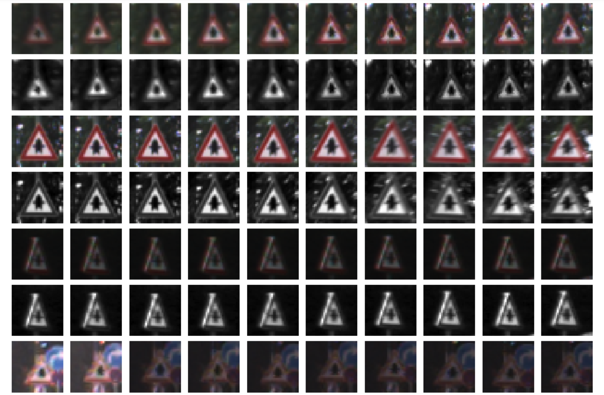
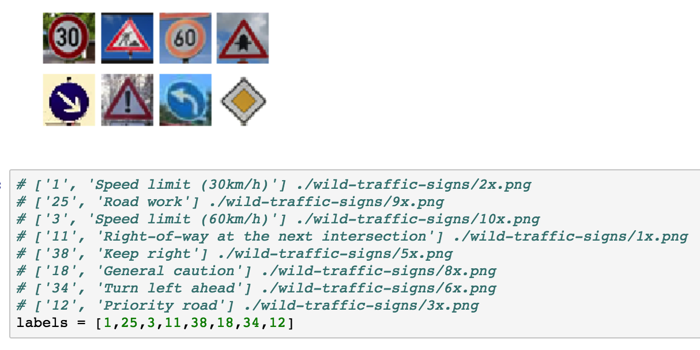
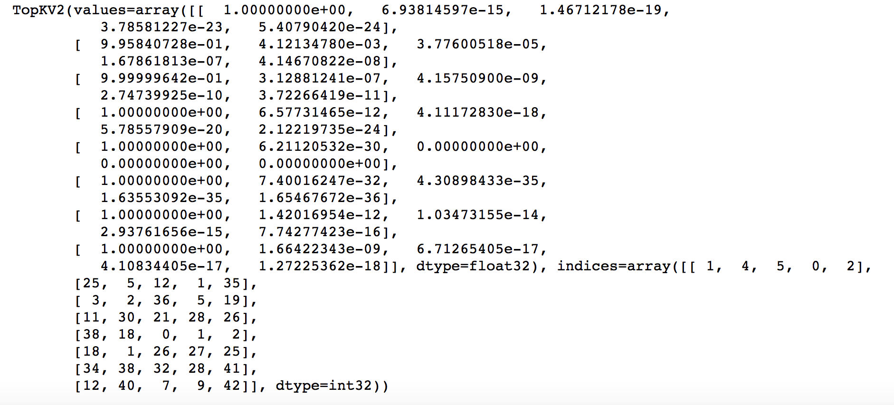

## *Traffic Sign Recognition*

Jay Urbain

---

**Build a Traffic Sign Recognition Project**

This project builds a deep convolutional neural network to classify 43 different traffic signs from the [German Traffic Sign Dataset](http://benchmark.ini.rub.de/?section=gtsrb&subsection=dataset)

The goals / steps of this project are the following:
* Load the data set (see below for links to the project data set)
* Explore, summarize and visualize the data set
* Design, train and test a model architecture
* Use the model to make predictions on new images
* Analyze the softmax probabilities of the new images
* Summarize the results with a written report

[//]: # (Image References)

[image1]: ./examples/visualization.jpg "Visualization"
[image2]: ./examples/grayscale.jpg "Grayscaling"
[image3]: ./examples/random_noise.jpg "Random Noise"
[image4]: ./examples/placeholder.png "Traffic Sign 1"
[image5]: ./examples/placeholder.png "Traffic Sign 2"
[image6]: ./examples/placeholder.png "Traffic Sign 3"
[image7]: ./examples/placeholder.png "Traffic Sign 4"
[image8]: ./examples/placeholder.png "Traffic Sign 5"

### Rubric Points
Here are the [rubric points](https://review.udacity.com/#!/rubrics/481/view) for the project.

---

Here is a link to my [project code](https://github.com/jayurbain/self-driving-car/blob/master/CarND-Traffic-Sign-Classifier-Project/Traffic_Sign_Classifier.ipynb)

### Data Set Summary & Exploration

#### 1. Provide a basic summary of the data set. 

The Pandas library was used to calculate summary statistics of the traffic signs data set:

* The size of training set is 34799
* The size of the validation set is 4410
* The size of test set is 12630
* The shape of a traffic sign image is 32
* The number of unique classes/labels in the data set is 43

#### 2. Include an exploratory visualization of the dataset.

Here are sample images from distinct traffic sign classes in the dataset.

Here is a bar chart showing the distribution of traffic sign classes.

### Design and Test a Model Architecture

#### 1. Describe how you preprocessed the image data. 

As a first preprocessing step, images were converted to grayscale from RGB. The idea is to simplify the data to focus on the patterns in the traffic signs.

Here are examples of a traffic sign image before and after grayscaling (alternating rows).

As a second preprocessing step, grayscale image data was normalized to zero-mean to reduce variance in lighting, and to improve learning efficiency, i.e., to converge to an optimal weighting quicker.

#### 2. Describe what your final model architecture looks like including model type, layers, layer sizes, connectivity, etc.) 

My final model is derived from the LeNet Architecture and consists of the following layers:

*LeTrafficeSigns* Architecture 

Layer 1: Convolutional. The input shape is 32x32x1 and the output shape should be 28x28x6.  
Activation. ReLU activation function.  
Pooling. Output shape should be 14x14x6.  

Layer 2: Convolutional. The output shape is 10x10x16.  
ReLU Activation.   
Pooling. The output shape is 5x5x16.  
Flatten. Flatten the output shape of the final pooling layer such that it's 1D instead of 3D.   

Layer 3: Fully Connected. 120 outputs.  
Activation. ReLU activation function.  

Layer 4: Fully Connected. 84 outputs.  
Activation. ReLU activation function.  

Layer 5: Fully Connected (Logits) with 43 outputs.  

Output 
Return the result of the 2nd fully connected layer.  

#### 3. Describe how you trained your model. The discussion can include the type of optimizer, the batch size, number of epochs and any hyperparameters such as learning rate.

The training pipeline consisted of:
- Calcualating the logits from the *LeTrafficeSigns* model.  
- Calculating the cross entropy from the logits using one-hot encoding.  
- Calculating the loss from the mean of the cross-entropy.   
- Using the AdamOptimizer to minimize the loss.

The training process consisted of:  
- Running the training data through the training pipeline to train the model.  
- Before each epoch, shuffle the training set.  
- After each epoch, measure the loss and accuracy of the validation set.  
- Save the model after training.

The hyperparameters were:  
- Learning rate: 0.001  
- EPOCHS: 40
- BATCH_SIZE: 123

#### 4. Describe the approach taken for finding a solution and getting the validation set accuracy to be at least 0.93. 

- Evaluated different normalization and scaling methods.
- Evaluated different number of training epochs.
- Evaluated different learning rates.

Experimented with different image preprocessing steps including image warping, croping, etc.

My final model results were:
* training set accuracy of 1.000
* validation set accuracy of .0.939 
* test set accuracy of .92

If an iterative approach was chosen:
* What was the first architecture that was tried and why was it chosen?

LeNet

* What were some problems with the initial architecture?

The majority of my problems were related to processing of the image data. How to generate grayscale images, different normalization methods, and properly displaying images at different steps of the pipeline.

* How was the architecture adjusted and why was it adjusted? 

I evaluated using 3 channel input (RGB) versus 1 channel input (grayscale) thinking that the color of traffic signs is a significant feature. There were no significant differents.

I also added another fully connected layer. This did not seem to help significantly. Porbably more exploration of learning rates would help.

I also tried an additional convolution and pooling layer, but training time increased signficantly.

If a well known architecture was chosen:  
* What architecture was chosen?  

LeNet  

* Why did you believe it would be relevant to the traffic sign application?  

Performed well on similar tasks.

* How does the final model's accuracy on the training, validation and test set provide evidence that the model is working well?
 
- Validation accuracy continually improved and then plateaued.  
- Accuracy on the test set is close to accuracy on the validation set.  
- High accuracy on traffic signs randomly downloaded from the web.

### Test a Model on New Images

#### 1. Choose five German traffic signs found on the web and provide them in the report. 

Here are 8 German traffic signs from the web:

#### 2. Discuss the model's predictions on these new traffic signs and compare the results to predicting on the test set. 

The model predicted the correct class for 100% of the 8 traffic signs.

#### 3. Describe how certain the model is when predicting on each of the five new images by looking at the softmax probabilities for each prediction. Provide the top 5 softmax probabilities for each image along with the sign type of each probability.   
 
| Image Classification | Highest Probability | Prediction  
-------------------------------------------------------------  
| ['1', 'Speed limit (30km/h)'] | 1.00 | '1' |   
| ['25', 'Road work'] | 0.96 | '25' |   
| ['3', 'Speed limit (60km/h)'] | 0.99 | '3' |   
| ['11', 'Right-of-way at ...'] | 1.00 | '11' |   
| ['38', 'Keep right'] | 1.00 | '38' |   
| ['18', 'General caution'] | 1.00 | '18' |   
| ['34', 'Turn left ahead'] | 1.00 | '34' |   
| ['12', 'Priority road'] | 1.00 | '12' |   

Top 5 softmax probabilities for each image:  
 

#### (Optional) Visualizing the Neural Network (See Step 4 of the Ipython notebook for more details)  
1. Discuss the visual output of your trained network's feature maps. What characteristics did the neural network use to make classifications?

- Will complete this later.  

